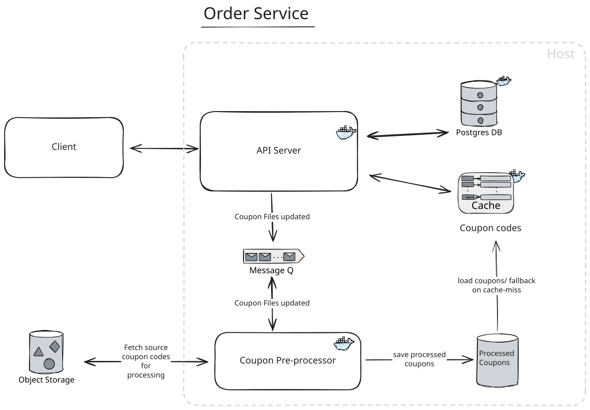
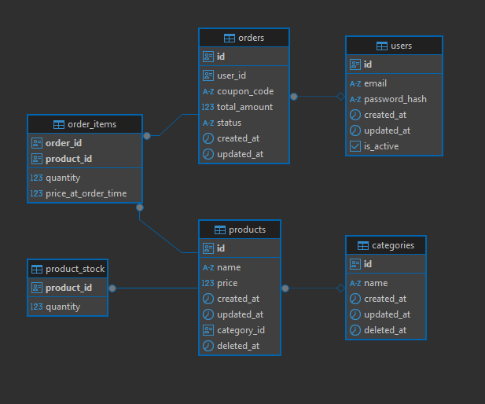

[Challenge](./challenge.md)

### Local Deployment Steps:
- Install Docker
- In `{project root}/backend-challenge/` directory, Run `docker-compose up`
- **API Testing:** UI for scalar api client, served at `http://localhost:8080/scalar`
<h2  style="text-align: center;">Architecture</h2>

*Architecture Overview*
- **Assumptions**
	- For Simplicity, A single tenant application is assumed and database schema is designed accordingly.

- Using Domain Driven Design(DDD), with co-location folder structure.
	- adapters (http_handlers, repositories, dao etc) --(depends on)--> services (service) -> domain (entities, validations etc)
- A loosely coupled monolith, with separate entry points for the server and worker. 
- Alternatively, in a large scale system, it can be broken in to 3 services - Orders Service, Products Service and Promo Service. 
- The code is organized with clear separation based on these features, making it ready to be scalable.
- #### Server:
	- A simple go server serving the apis listed in [api/openapi.yaml](api/openapi.yaml). 
	- GET `/product` list api Supports query params like name, categoryId, limit, offset etc
	- POST /order api is secured with header 'api-key':'apitest' header

- #### Worker: 
	- Loads the compressed coupon code files, processes and generates a single valid coupons list file. The generated file is stored as a shared volume on the host machine. Then triggers a http call to server, so the server can update the cache(alternatively, main server can watch processed_coupon.txt with inotify).
	- This process runs both on server startup and also while polling, when the input files are updated.
	- Will be deployed as a separate long running worker container that continuosly polls a message queue(redis in this case, for simplicity) to listen for file changes. (If files were static, this would be a single removable job).
	- Alternatively, in a production setting, the worker job can be offloaded to a serverless(eg: AWS Lambda) function, that can process and save the processed list file in AWS S3, and update the redis cluster.
- **Database:** Postgres DB is chosen for its ACID compliance (transactions for order placing and stock count reduction), strong consistency and better handling of relational data.
	
- **Deployment** with Docker Compose
	- Going with docker-compose for the simple use case.
	- Kuberenetes would be preferable for distributed, Multi-tenant SaaS deployments.
	- Will try to deploy to AWS ECS if time allows for it.

### System Requirements
- Naive Approach:
	- Worker Job may require at most a RAM size upto 14 GB. Docker Desktop might be needed to configure to allow for higher memory allocation.
	- Worker Job Requires processing 3 * 1GB files(~100M). Based on coupon validity requirements, At most 200M coupon tokens might have to be loaded on to a golang map object. (map object = 70-80 bytes per coupon * 200 M = 14GB)
## Technology Choices
- Golang for backend server and worker (Required)
- Postgres - with squirrel sql query builder. 
- Redis for Cache and as a message Queue
- Gin for router.
- zap for logging
- viper for loading config

---
- ### [Todo](./TODO.md)
- ### [In Progress](./IN_PROGRESS.md)
- ### [Done](./DONE.md)

